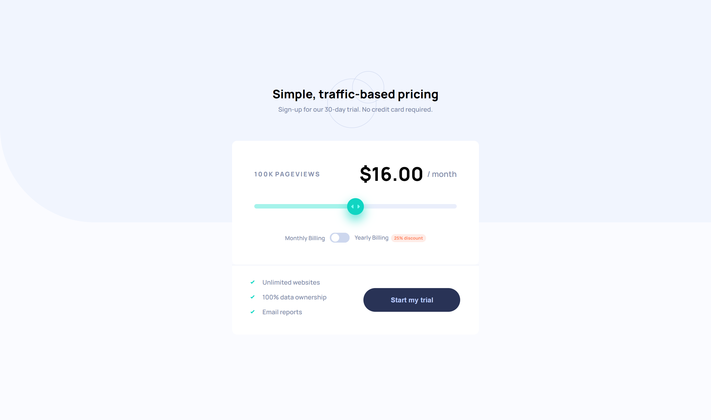

# Frontend Mentor - Interactive pricing component solution

## Welcome! 👋

This is a solution to the [Interactive pricing component challenge on Frontend Mentor](https://www.frontendmentor.io/challenges/interactive-pricing-component-t0m8PIyY8).

## Design Preview

## Table of contents

- [Overview](#overview)
  - [The challenge](#the-challenge)
  - [Links](#links)
- [Built with](#built-with)
- [Author](#author)

## Overview

### The challenge

Users should be able to:

- View the optimal layout for the app depending on their device's screen size
- See hover states for all interactive elements on the page
- Use the slider and toggle to see prices for different page view numbers
- If the visitor switches the toggle to yearly billing, a 25% discount should be applied to all prices.

### Links

- [Live Site URL](https://sbefaro.github.io/FrontentMentor-Interactive-Pricing-Component/)

## Built with

- Semantic HTML5
- CSS custom properties (no preprocessors used)
- JavaScript 
- Flexbox Model
- Mobile-first workflow

## Author

- Frontend Mentor - [@SBefaro](https://www.frontendmentor.io/profile/SBefaro)
